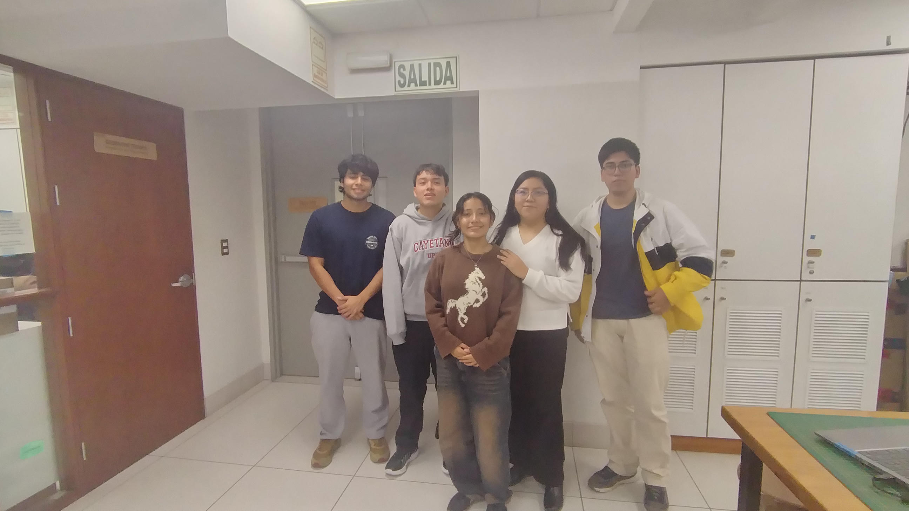
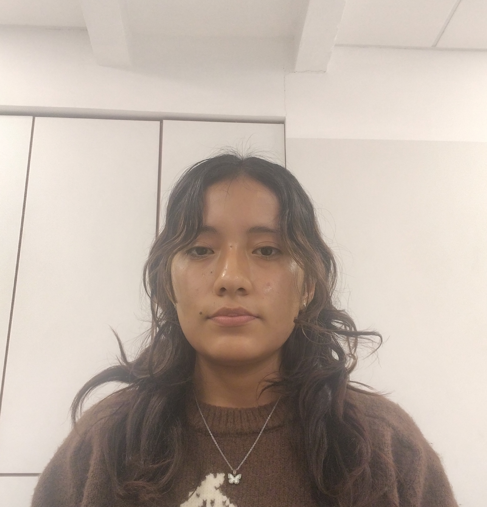
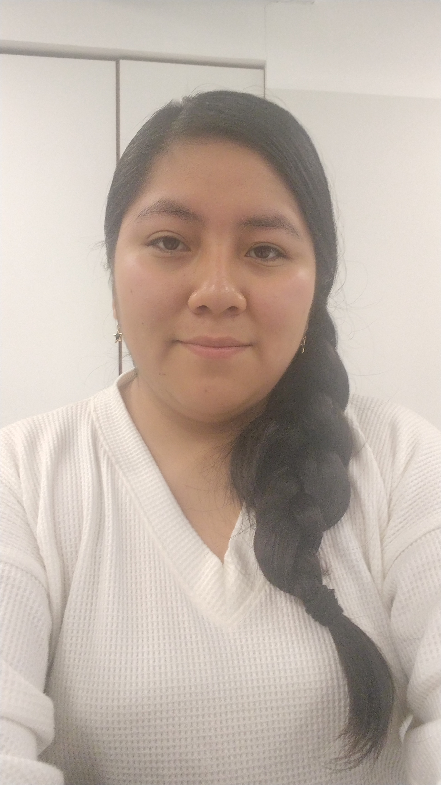
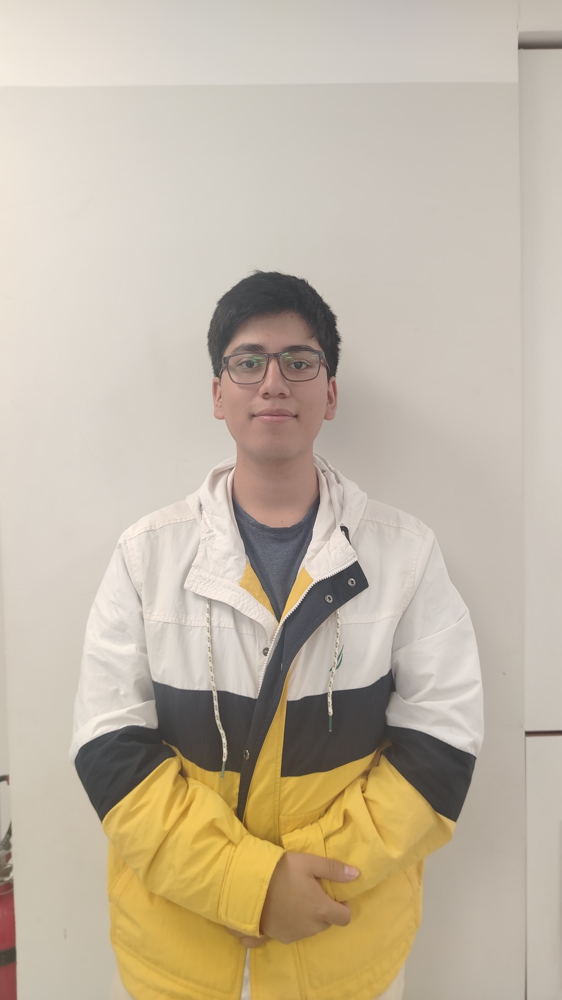
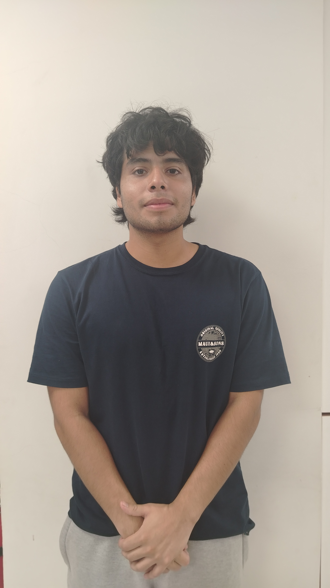
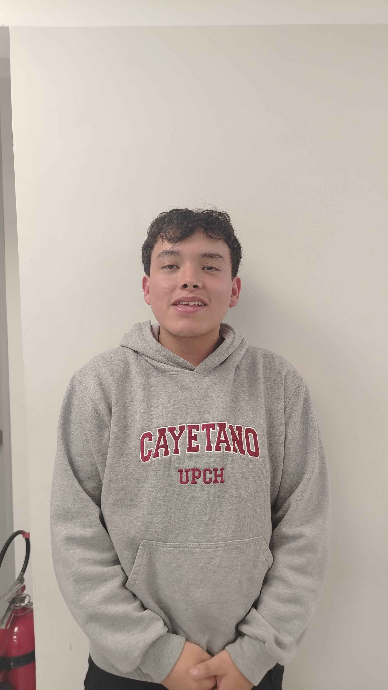

# Equipo 01 - Fundamentos de Biodiseño
### Carrera de Ingeniería Biomedica
**Universidad Peruana Cayetano Heredia**

---

## 🌍 Descripción del Equipo 
Somos el **Equipo 01** del curso **Fundamentos de Biodiseño 2026-**, conformado por estudiantes de la carrera de Ingeniería Biomedica.
Nuestro objetivo es aplicar la metodología de diseño para generar soluciones innovadoras con impacto social, tecnológico y ambiental.  

Nos interesa trabajar en los siguientes **Objetivos de Desarrollo Sostenible (ODS):**  
- ODS 3: Salud y Bienestar  
- ODS 9: Industria, Innovación e Infraestructura  
- ODS 11: Ciudades y Comunidades Sostenibles  

---

## 📸 Fotografía del Equipo  

  <em>Figura 1. Fotografía del equipo 01</em>

---

## 👥 Integrantes del Equipo  

| Foto | Nombre | Rol | Intereses |
|------|--------|-----|-----------|
| | **Eliane Caceres** | Prototipado | Innovación social, sostenibilidad |
|  | **María Casas** | Responsable de investigación | Gestión ambiental, desarrollo comunitario |
|  | **Marcos Arias** | Circuitos /Progrmadador| Diseño de prototipos, creatividad aplicada |
|   | **Nicolas Barco** | Lider | Comunicación científica, redacción técnica |
|  | **Fernando Arrunategui** |  Encargado de Documentacion | Programación, análisis de datos, simulación |

---

## 📌 Resumen Final  
Este README resume quiénes somos, qué nos motiva y en qué ODS queremos enfocar nuestro trabajo durante el curso.  
